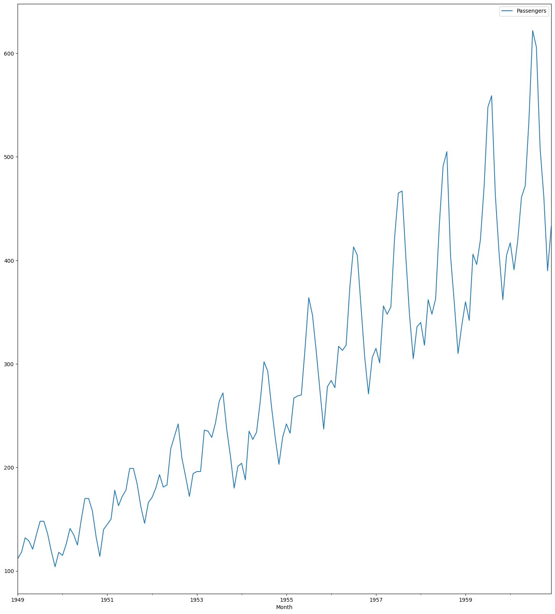
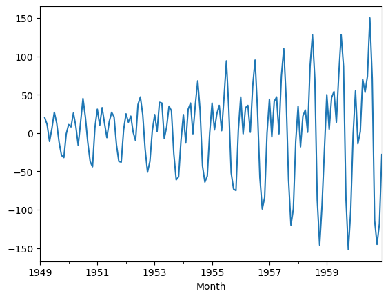
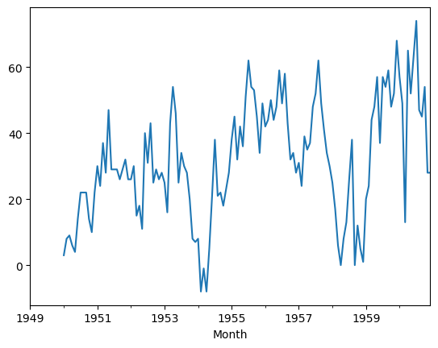
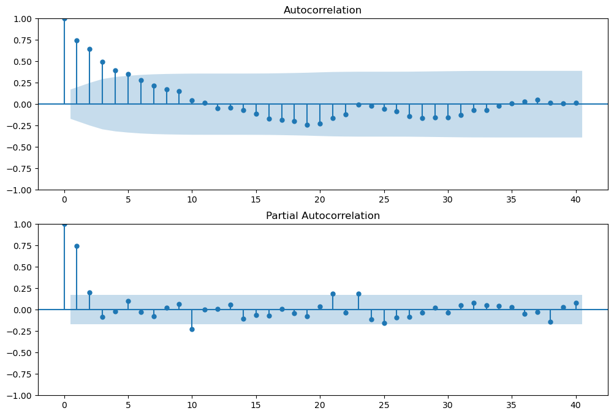
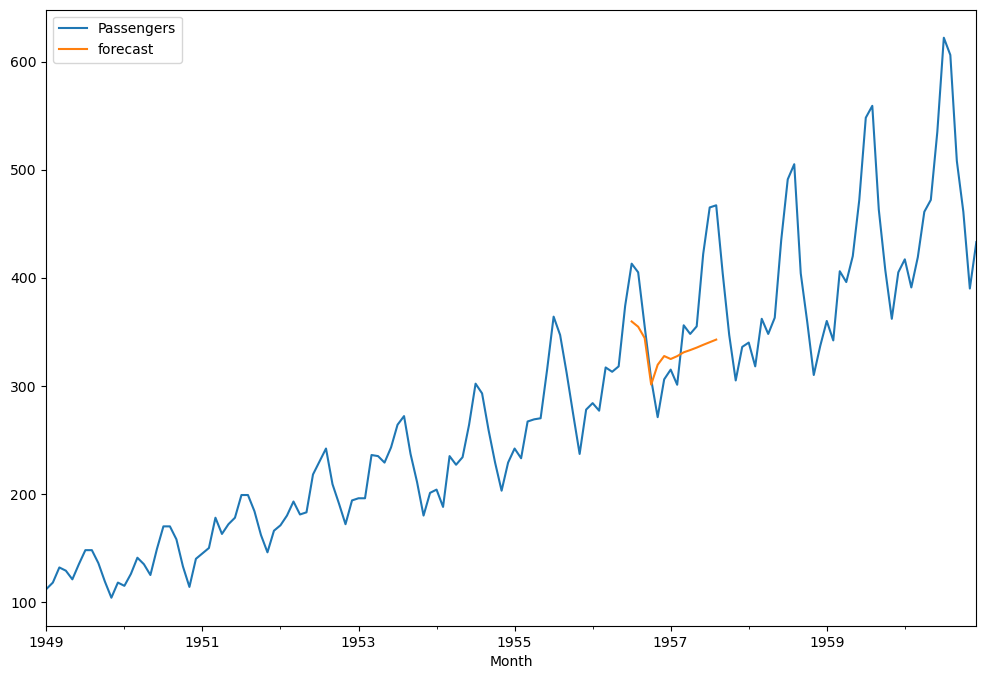
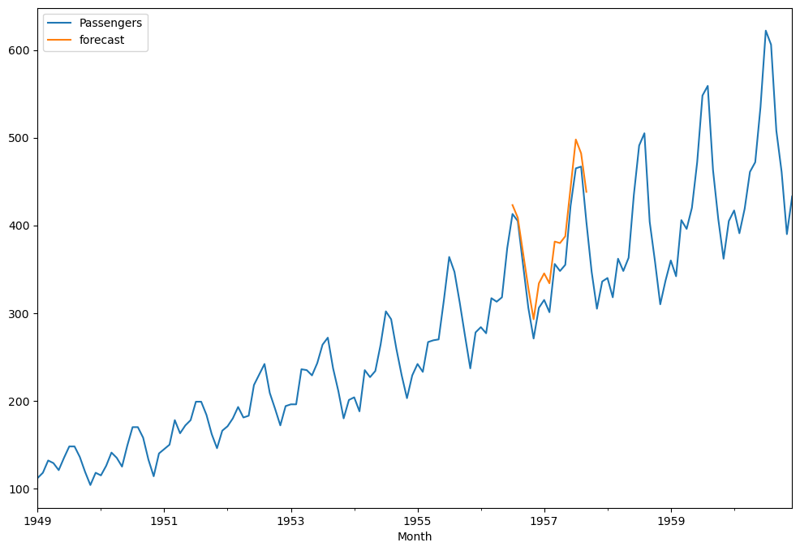
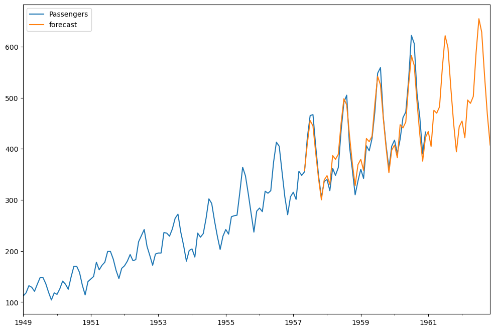

# Airline Passenger Forecasting

This project is a time series forecasting task using the ARIMA (AutoRegressive Integrated Moving Average) model to predict the future passenger counts for an airline based on historical data. It is a fundamental time series analysis project aimed at making predictions for future time points.

## Data

The dataset used in this project contains historical records of passenger counts for an airline. It includes a time series of passenger counts over a certain period.

Fig: Preview of data trend

## Approach

The project follows these key steps:

1. **Data Loading and Preprocessing**:
   - The dataset is loaded and examined to understand its structure.
   - Null values are checked and handled as needed.
   - The time series data is converted to a datetime format.

## **Stationarity Check**:

- The Augmented Dickey-Fuller test is used to check the stationarity of the time series data.

## **Differencing**:
   - Differencing is applied to make the time series stationary, removing trends from the data.

Fig: After 2nd shift differening 

Fig: After removing seasoning 

## **ACF and PACF Analysis**:
   - Autocorrelation Function (ACF) and Partial Autocorrelation Function (PACF) plots are created to determine the parameters (p, d, q) of the ARIMA model.

Fig: ACF and PACF analysis plot

 ## **Modeling**:
   - The ARIMA model is constructed using the `statsmodels` library.
   - Parameters (p, d, q) are defined for the ARIMA model.
   - The order for seasonal differencing (P, D, Q, s) is set for the SARIMA model.

## **Model Fit and Forecast**:
   - The ARIMA and SARIMA models are fitted to the data using the `model.fit()` method.
   - Forecasting is performed for future time steps using `model_fit.predict()`.

## **Visualization**:
   - Original time series data and forecasted values are plotted to visualize the model's performance.

Fig: ARIMA forecast  

Fig: SARIMA forecast

## **Future Forecast**:
   - Future dates are generated for future forecasting.
   - The ARIMA model is used to forecast passenger counts for future dates.
   - The forecasted values for future dates are plotted alongside historical data.

Fig: Future forecast

## Usage

To run this project locally, you can follow these steps:
 - Clone the repository to your local machine.
 - Run the project's main script to perform data analysis and forecasting.

## The project is organized as follows:

- `AirPassengers.csv`: Contains the dataset used for training and testing.
- `time series project.ipynb`: Jupyter notebooks with code for data preprocessing, model training, and evaluation.
- `README.md`: This file.

## Dependencies

The project utilizes the following Python libraries:
- NumPy
- pandas
- matplotlib
- statsmodels
- scikit-learn

These dependencies can be easily installed using the `pip install` command.

## Author

This project was created by MD Fahim Afridi Ani. You can contact the author via Email: fahimafridi043@gmail.com.

Enjoy exploring and forecasting airline passenger counts using ARIMA!

